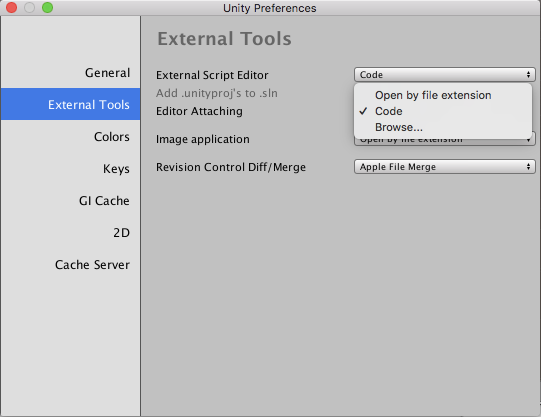

# A. Our project

Our goal is to build a parodic version of Call of Duty. We will use the Unity game engine with the C# language. Please refer to the [Unity API](https://docs.unity3d.com/ScriptReference/).

## Members

- [William Wu](https://gitlab.com/Quaderatics) (period 6)
- [Simon Yu](https://gitlab.com/SimCode989) (6)
- [Aditya Mehta](https://gitlab.com/93IQ) (6)
- Maxwell Huang (4)

UPDATES ABOUT ASSIGNMENTS AND REQUIREMENTS PENDING

# B. Unity 101

You will need the [Unity development platform](https://unity3d.com/get-unity/download) and any IDE that can handle C#, as well as [Git](https://git-scm.com/downloads) for version control.

When you're first starting out, set up a local Git repository (see "Git 101" below) and pull from the remote. A Unity project should be added to your folder, which you can then open and edit in Unity. To edit the C# scripts in an external IDE, go to Unity's preferences > External Tools > External Script Editor and select the program you want to use (you may have to browse for it).



To open a C# script file in the external IDE, select the file in the project pane at the bottom, then click Open in the inspector on the right side.


# C. Git 101

Note: when you see `something like <this>`, which indicates code to type, copy it exactly EXCEPT for whatever is inside the `<>`. Replace the `<>` with something that makes sense, and don't include the actual brackets themselves.

## Make and submit changes

If you're just starting, refer to the "Create and link a local repository" section at the bottom to set up a repository. Then, whenever you work on some part of the project, navigate to your project folder in the terminal/command prompt and do the following:

1. Make sure you're up to date in your local repository. IT IS ABSOLUTELY ESSENTIAL THAT YOU DO THIS TO AVOID LOSING ALL YOUR WORK. GIT MAY REFUSE TO ALLOW YOU TO SUBMIT YOUR CHANGES UNLESS YOU ARE UP TO DATE.
    
    ```
    git checkout master
    git pull origin master
    ```

2. Create a new branch of the project. This allows you to isolate your changes from everyone else so you can work on a specific part (e.g. a certain class). When you finish, your branch is merged back into the master branch.
    
    `git branch <branch name>`
    
    Switch to your new branch with `git checkout <branch name>`

3. Write some code, blah blah blah. When you feel like you've reached a good checkpoint where things are working pretty well (not necessarily finished, but nothing will break), then:
    
    Run `git status` and look for any "Untracked files" in the output. If some files in the project are untracked, that means that Git will not include them when it updates. So, if there are any untracked files, run `git add -A .` to include all of them.
    
    Run `git commit -m '<message>'`. A commit is a sort of snapshot of the repository which we can compare to commits made at other points in time to see what's changed. The message should be short and simple but still descriptive of what you've changed, like "Added newclass.js" or "Added ability to do X" or "Made bots more difficult".

4. Submit your changes to your branch in the remote repository.
    
    `git push origin <branch name>`
    
    You should repeat steps 3 and 4 throughout the process of working on your part of the code. Save your code in the editor the most often, commit your changes locally when you finish some subsection of your assignment, and push to the remote at the end of the day.

5. In the repository on GitLab.com (where you are when you're reading this), make a new merge request ([tutorial](https://docs.gitlab.com/ee/gitlab-basics/add-merge-request.html)) to have your code reviewed and merged with the master.
    
    The source branch should be the branch you've been working on, and the target branch should be master. Assign the request to William Wu (Quaderatics) and ignore the milestones and labels.

6. If your merge request is accepted, switch back to master and delete your branch:
    
    ```
    git checkout master
    git branch -d <branch name>
    ```
    
    If there are still things you have to change, return to step 3 and repeat. You will not have to create a new merge request - just notify William when you're ready and push your changes again.

Summary:

1. `pull` from master
2. `branch` and `checkout`
3. `status` and `commit`
4. `push` to remote
5. merge request

## Create and link a local repository

You will need a Git repository on your computer to transfer changes/updates to and from this one online.

1. Create a new folder to contain all the project files. Make sure you can access it easily.

2. Navigate to this folder in the terminal/command prompt.
    MacOS and Windows: `cd <filepath>`

3. Enter the following commands:
    ```
    git init
    git remote add origin git@gitlab.com:Quaderatics/APCS-2018.git
    ```
